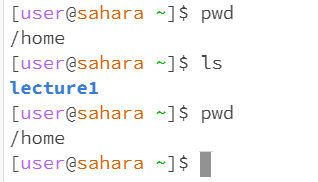

# Basic Filesystem Commands
## cd command  
- With no arguments  
  
The cd command with no path specified as an argument changed the working directory from lecture1 to the home directory as seen above  
- With a path to a directory as an argument  
  
The cd command with a path specified switches the working directory to the directory of that path  
- With a path to a file as an argument  
  
The command returned an error because the cd command is used to switch directories, and a file is not a directory  
## ls command
- With no arguments  
  
As seen above, typing the ls command with no argument lists the folders/files of the current directory you are in. In this case, the home directory contains the lecture1 folder  
- With a path to a directory as an argument  
  
As seen above, typing the ls command with a path as an argument lists the folders/files of the directory specified in the argument. In this case, it lists the files/folders of lecture1. <cd>
- With a path to a file as an argument  
  
As seen above, typing the ls command with a path to a file as an argument simply outputs the file path specified in the argument.
## cat command
- With no arguments  
  
Typing the cat command by itself with no arguments puts the terminal into an interactive mode where anything the user types is echoed back. In the above screenshot the user typed hello and echo, which were both echoed back. The mode was exited when the user used ctrl+C  
- With a path to a directory as an argument  
  

